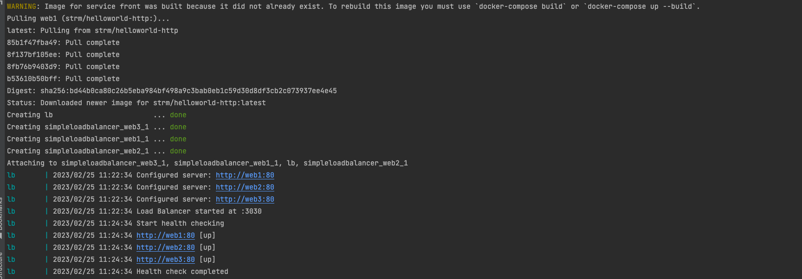
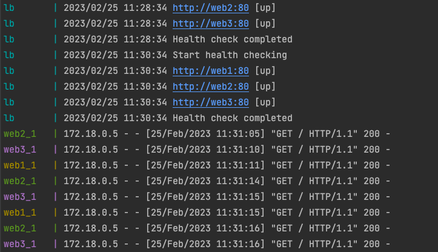
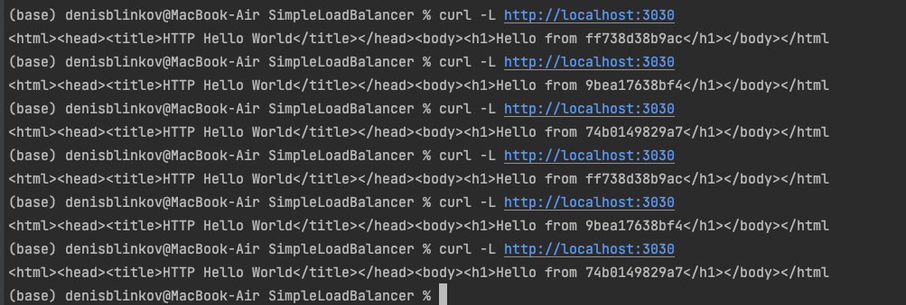
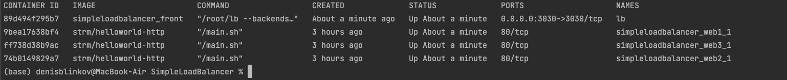

# Purpose
Just to train some skills in writing applications using Go.

# SimpleLoadBalancer
This load balancer uses RoundRobin algorithm to send requests into set of backends. It supports attempts and retries.

It also performs active cleaning and passive recovery for unhealthy backends.

# How to use
```bash
Usage:
  -backends string
        Load backends to balance wich, use commas to separate
  -port int
        Port to serve (default 3030)
```

Example:

To add followings as load balanced backends
- http://localhost:3031
- http://localhost:3032
- http://localhost:3033
- http://localhost:3034

We use
```bash
./lb --backends=http://localhost:3031,http://localhost:3032,http://localhost:3033,http://localhost:3034
```

# External docker images
`strm/helloworld-http` -  is a simple 'Hello world' in an HTTP server to be used to test load balancers. When receive an request (GET /) this image will return the current machine hostname.

# Working app screens
- building app


- balancing requests between backends


- curl API


- docker ps


# How to run
1. docker-compose up

# What I've done
1. HTTP proxying
2. Removing backends if they are down
3. RoundRobin backend resolver
4. "Tolerant policy" for non-200 return code
   1. Retries if backend didn't answer
   2. Attempts if another backend picked for current request
5. HealthCheck for backends to check if they're alive and modify their statuses 
6. Showed using of goroutines (health check running in different Go thread), atomic package, mutexes, channels (used for timers, no too smart but anyway)
7. Dockerized application (multi-stage build)

# What I didn't do, but can ?
- more tests with more sense
- measure of performance
- Even cleaner code (if I got at least one code review)
- Grafana & Prometheus metrics